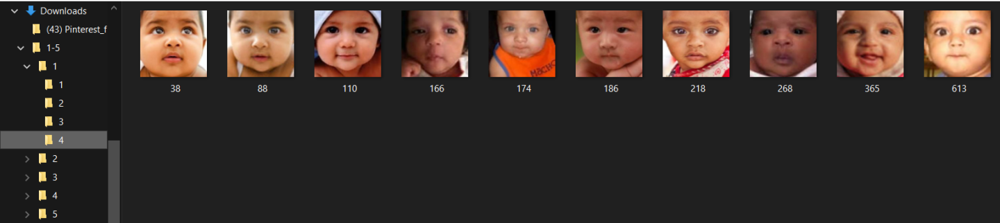
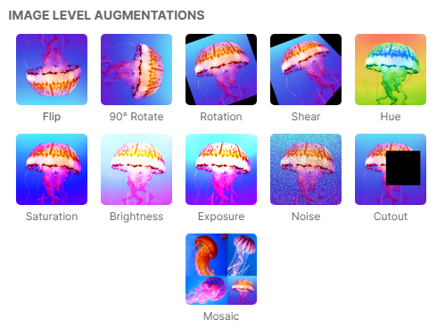
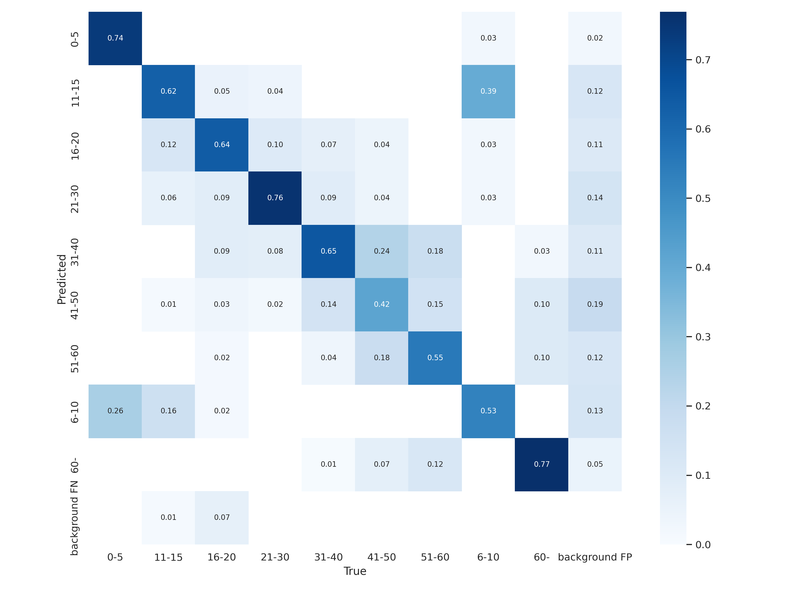
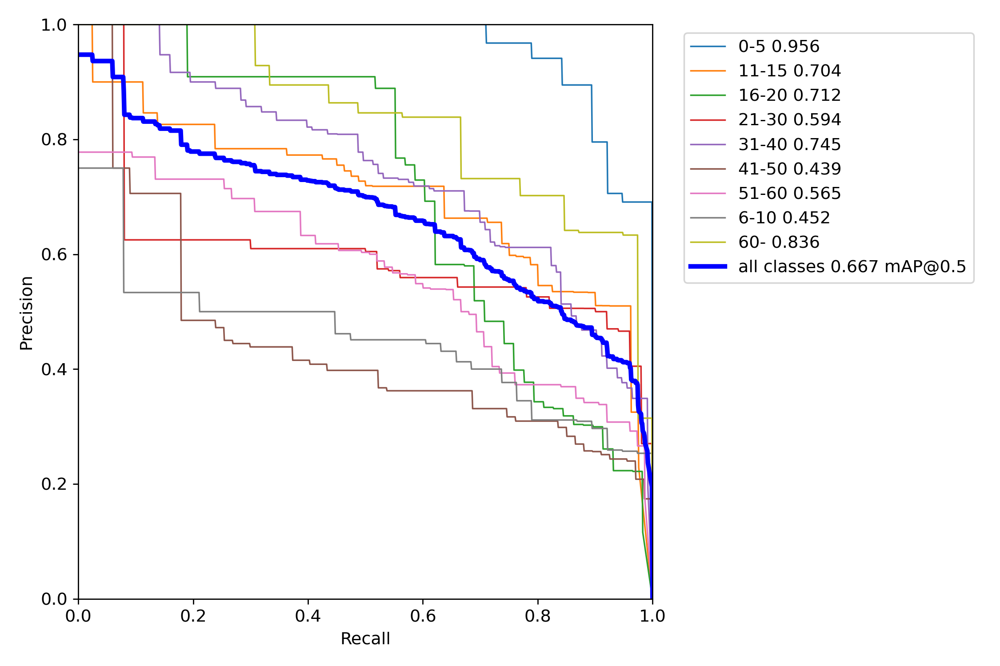
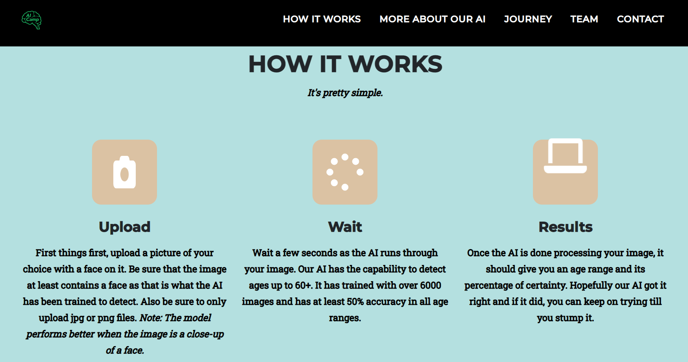
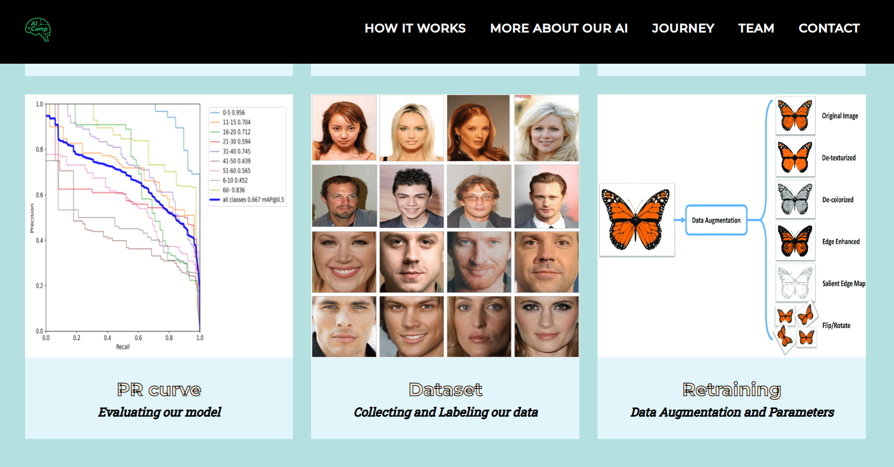
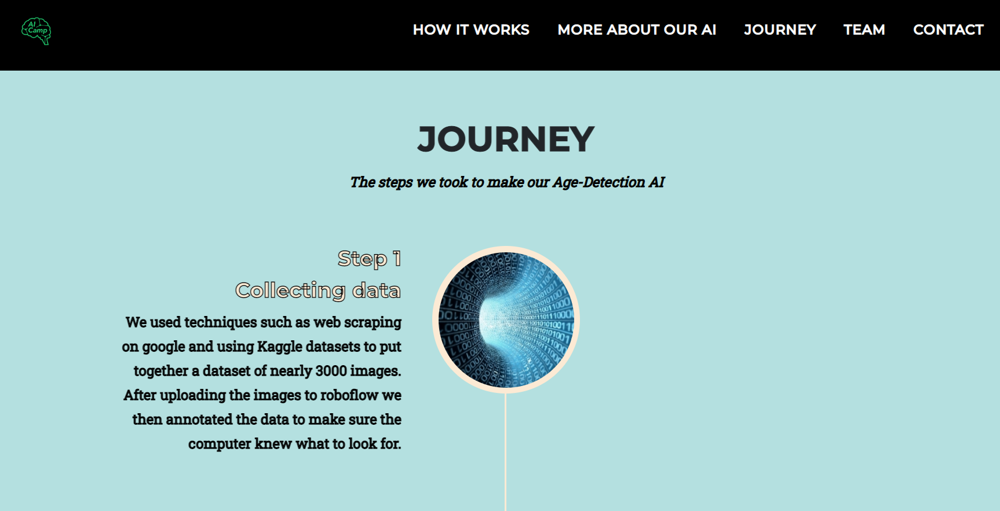

## Overview

Computer vision was first attempted in the the early 1960's, with universities attempting to get a computer to see images as more than pixels. These early attempts failed, but still laid the groundwork for future development in artificial intelligence.

Now after 6 decades, our team has developed a prototype Computer Vision model that can tell you your general age.

We created this model over the course of three weeks, and have encountered many roadblocks along the way. Thankfully though, we have overcome most and even blasted a few out of our way, to achieve our goal. 

The choice of making an artificial intelligence that could identify age based on your appearance was one of many options. At first, we were considering identifying different medicinal pills, or finding the difference between certain foods. But we felt that overall, the practicality of an Age identifier was needed. 

One of our teammates pointed out how necessary age identification was in the medical field. When treating patients without identification, doctors would be able to tell a patient's age and help them on a path to recovery using care specifically designed for their age group. Age is also an important factor for criminal identification. If general age could be identified for a suspect caught on camera, the police could have a more accurate profile to investigate or release to the public.

Some of the platforms, databases, and coding languages include: **Python, HTML, CSS**, Cocalc, Google Colab, **Roboflow, Kaggle**, Wandb, Github, Flask,  Start Bootstrap Templates, **SerpAPI, Yolov5**.

To actually achieve this goal fully though, we needed to complete many steps in order to construct a fully functioning model. Here are the steps we took to achieving age identification:

If you have any questions, feel free to open an issue on [Github](https://github.com/organization-x/omni/issues).

# Data Collection

Our dataset contains 3,111 images, all split into ranges of different intervals. The ranges go from **0-5, 6-10, 11-15, 16-20, 21-30, 31-40, 41-50, 51-60, and finally 60+**. In addition to age ranges, our dataset also includes backgrounds to help the AI recognize what is and isn't a face.  

When gathering the images for our dataset, we had to ensure that there was an even number of skin tones and genders. Having too much of any in the dataset enables bias in our AI, allowing it to identify the age that it is biased towards more often than the others. 

Our group gathered images through three methods: **Web scraping** via **SerpAPI**, downloading Kaggle datasets, and downloading images manually from google. Web scraping is a process that automatically extracts data from a website. For example, our group would tell the process to search up city backgrounds and extract 200 images. It would do so and put it in a file in which our group simply had to download and unzip to access. Kaggle datasets are premade datasets that gave our group easy access to images. In some cases, we had to result to manually finding images online.

After gathering images for our dataset, the next step was to annotate the images. We uploaded all of the images gathered into **Roboflow**, a website that provides tools to convert raw images into usable data for our AI. Once uploaded, everyone went through each of the images, assigning the proper age ranges and removing any blurry, duplicated, or watermarked images that would damage the process. Once that was done, we had the proper data to train our model. 

Before providing the model with our dataset, we added **data augmentations**, which are modified copies. For example, the two augmentations that our group tend to go with were crop and blur, which would produce duplicates with random crops and blur from the dataset. In this case, it allowed the AI to be trained to better recognize faces that were slightly blocked or blurry. 

### Model Training

Our model of choice was Yolov5s, a model that was small enough to have a low load on the GPU and short runtime, while still being able to retain a high level of accuracy. The platform we trained our model on was Google Colab.

The parameters we chose can be seen below

`DIM = 512
BATCH = 64
EPOCHS = 400
MODEL = 'yolov5s'`

For the image size, we simply went with the highest value we could without the GPU ram having issues on Colab. For the batch size, we decided to go with the Yolov5 Github recommended values, as they were backed up by lots of runs and experience. For the number of epochs, we started off with the Github recommended baseline at 300, and after that showed no signs of overfitting we decided to move the number of epochs up to our final number at 400.

Here is the link to the Colab document we used for our model: https://colab.research.google.com/drive/1zBmYJwIycftgS_0azZ6jcOYtagIxUIu1?usp=sharing

### Metrics

A confusion matrix is a graph that shows the true answer for a specific label and the percentages of guesses for each possible answer in a decimal percent. The confusion matrix given from the final training of our AI had an average of ~60 percent accuracy.

It can be seen that when the AI made mistakes, the error usually fell into the neighboring age ranges. For example, the 41-50 age range had the most mistakes by confusing it for the 31-40 and the 51-60 ages.

The mAP or mean average precision is similar in that when our AI has 20-70 percent confidence the precision was around 60 percent. When the AI had confidences of 80 plus, our AI had an overall higher precision in the 75-100 percent precision range.

The P and R in a PR_curve stand for precision and recall respectively. Precision falls under the y-axis and Recall falls under the x-axis. A PR_curve is used to evaluate an AI's accuracy and find a possible imbalance in data.

Precision is calculated with the formula of true positives divided by the number of true positives plus false negatives.

`(TP / TP + FP)`

Recall is calculated with the formula of true positives divided by the number of true positives plus false positives.

`(TP / TP  + FN)`

It is most desirable to have a large area under the curve to show good precision and good recall. However, there often can be a trade-off between the two shown by a PR_curve.

Our graph has a trend of starting with high precision and going down to lower amounts as the Recall gets higher. Meaning that when there were no false negatives in our predictions, there were many false positives and less true positives. This indicates a problem with identifying the exact correct age range.

### Web Deployment

First, we downloaded a template from bootstrap (*this is the template we used:* https://startbootstrap.com/theme/agency). Our front end team worked on customizing the template, while the backend team created a results page and connected our model to the website using flask. 

##### Website Images

##### Flask

To connect our backend to our front end, we used flask. Flask is a web application framework written in Python. It allows you to pass python variables into an html script. (*Read more about Flask here:* https://pythonbasics.org/what-is-flask-python/)

We used flask to connect our home page to our results page by uploading an image using a button. 

We also used flask to connect our model to our website.

### Future Works and Improvements

In the future, we would like to add more labels by splitting up the age ranges into more specific categories. In addition to that, we will work on including full body images in the data set and train our model more. The performance of our model is something we will need to work on so that we can make it more precise and robust.

Some other functions we want to consider adding are object tracking and having our model be able to recognize moving objects. This would make our model more practical for being used in criminal identification because it would be useful in detecting the age of suspects in security footage.

### pytorch_model.bin ###

The weights file - must upload if you are running file on coding center or are trying to deploy.

### main.py ###

Contains the main flask app itself.

### requirements.txt ###

Contains list of packages and modules required to run the flask app. Edit only if you are using additional packages that need to be pip installed in order to run the project.

To generate a requirements.txt file you can run

`pip list --format=freeze > app/requirements.txt`

the requirements.txt file will then be updated. Keep in mind: some packages you install on one operating system may not be available on another. You will have to debug and resolve this yourself if this is the case.

### static/ ###

Contains the static images, CSS, & JS files used by the flask app for the webpage. You will need to create this and put files in it. Place all your images used for your website in static/images/ so that you can then reference them in your html files.

### utils.py ###

Contains common functions used by the flask app. Put things here that are used more than once in the flask app.

### templates/ ###

Contains the HTML pages used for the webpage. Edit these to fit your project. index.html is the demo page.

### Files used for deployment ###

`config.py`
`Dockerfile`
`entrypoint.sh`
`nginx_host`
`host_config`
**Only modify `host_config`. Do not touch the other files.**

